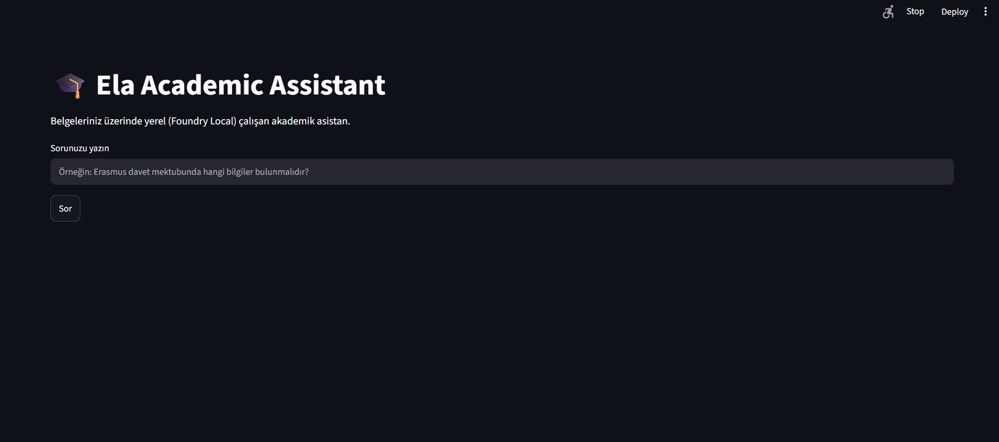
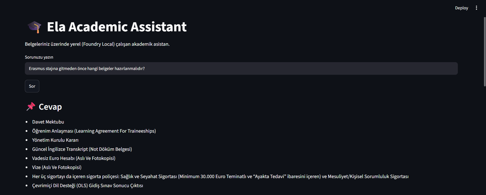
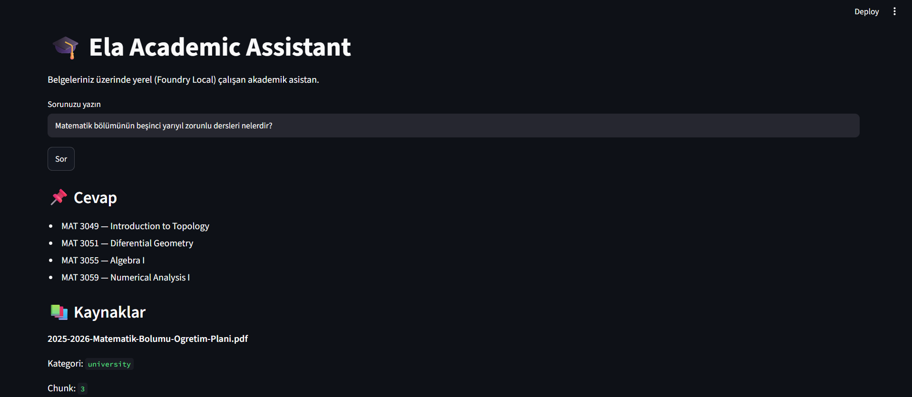
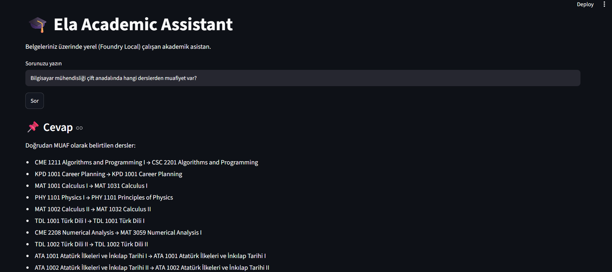
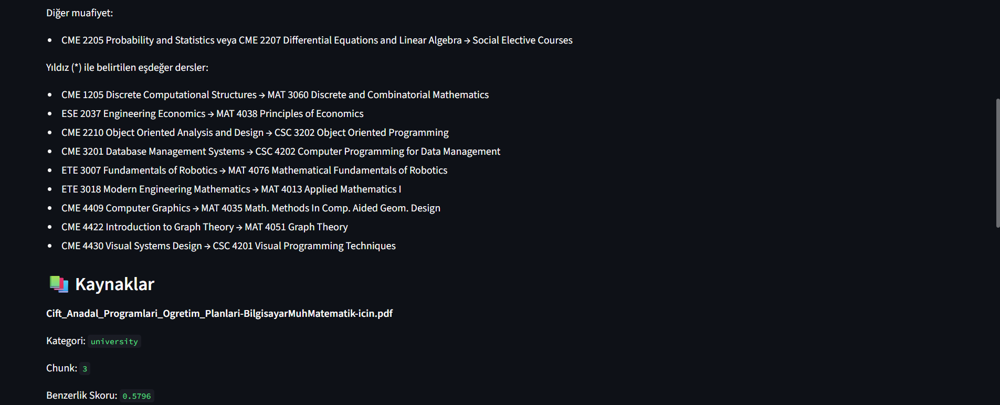
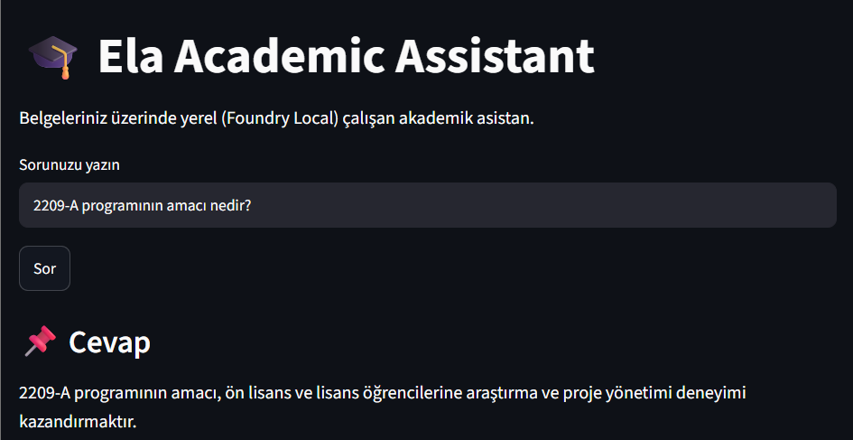

# Ela Academic Assistant

A fully local **Retrieval-Augmented Generation (RAG)** application built with **Microsoft Foundry Local**, **Streamlit**, and **SQLite** for answering questions over academic documents.

The assistant performs semantic search on PDF and DOCX files, retrieves the most relevant document chunks, and generates grounded answers using a locally running language model.


## Features

- Ask questions about academic PDF and DOCX documents
- Semantic search using vector embeddings
- Fully local AI inference with Microsoft Foundry Local
- Source-aware answers with document references
- SQLite vector database
- Interactive Streamlit interface
- Custom extractive parsers for structured university documents
- Works completely offline after setup


## Technologies

- Python
- Microsoft Foundry Local SDK
- Streamlit
- SQLite
- NumPy
- PDFPlumber
- python-docx

## System Architecture

```text
User Question
      │
      ▼
Streamlit Interface
      │
      ▼
Semantic Retriever
      │
      ▼
SQLite Vector Database
      │
      ▼
Relevant Document Chunks
      │
      ▼
Extractive Parser
      │
      ▼
Phi-3.5 Mini (Foundry Local)
      │
      ▼
Final Answer
```

## Example Questions

Here are some example questions the assistant can answer:

- What are the compulsory courses in the fifth semester of the Mathematics Department?
- Which documents should be prepared before an Erasmus internship?
- What information should be included in an Erasmus invitation letter?
- What are the eligibility requirements for TÜBİTAK 2209-A?
- Which Computer Engineering courses are exempt in the Double Major Program?

## Project Structure

```text
Ela-Academic-Assistant
│
├── app.py                 # Streamlit application
├── requirements.txt
├── README.md
├── LICENSE
│
├── documents/             # Source academic documents
├── data/                  # SQLite vector database
├── tests/                 # Debug and testing scripts
│
└── src/
    ├── answer_builder.py
    ├── chat_engine.py
    ├── chunker.py
    ├── database.py
    ├── document_loader.py
    ├── embedding.py
    └── retriever.py
```

## Installation

### 1. Clone the repository

```bash
git clone https://github.com/YOUR_USERNAME/Ela-Academic-Assistant.git
```

### 2. Navigate to the project

```bash
cd Ela-Academic-Assistant
```

### 3. Create a virtual environment (optional)

```bash
python -m venv .venv
```

### 4. Activate the virtual environment

Windows

```bash
.venv\Scripts\activate
```

macOS / Linux

```bash
source .venv/bin/activate
```

### 5. Install dependencies

```bash
pip install -r requirements.txt
```

## Usage

Run the Streamlit application:

```bash
streamlit run app.py
```

Then open your browser and navigate to:

```text
http://localhost:8501
```

## Screenshots

### Home Page



---

### Erasmus Internship Checklist



---

### Mathematics Curriculum



---

### Double Major Course Exemptions





---

### TÜBİTAK 2209-A Information



## Project Demo

A short presentation of Ela Academic Assistant, covering the project motivation, RAG workflow, development process, debugging experience, and key learnings.

▶️ [Watch the Project Presentation](presentation/Ela-Academic-Assistant-Demo.mp4)

## Future Improvements

- Hybrid search (Semantic + Keyword)
- Conversation memory
- OCR support for scanned documents
- Multi-document reasoning
- Re-ranking for more accurate retrieval
- Highlighting cited passages in documents
- Support for additional document formats

## License

This project is licensed under the MIT License.

See the [LICENSE](LICENSE) file for more information.
